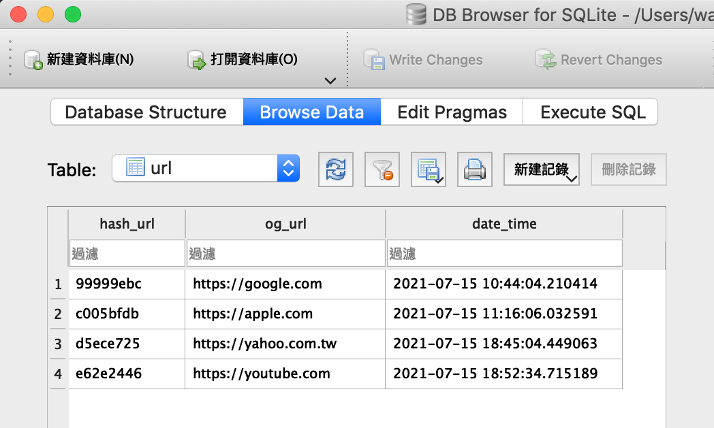
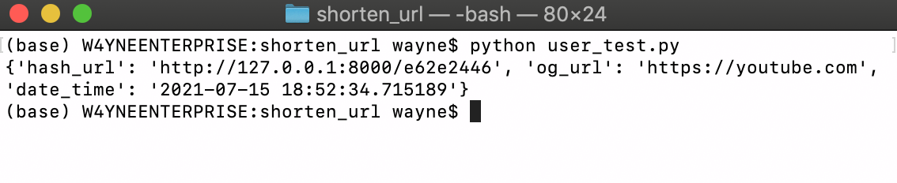
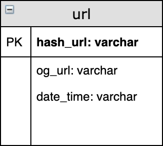

# Short Url Service

<br>

**一個使用python + FastAPI開發的簡單短網址後端API**

## 事前準備

```shell
# 新增且開啟虛擬環境後安裝環境
cd shorten_url
pip install requirement.txt
```

<br>

## 使用方法

```shell
# 開啟local server
uvicorn main:app
```

### 長轉短

```
method: post
url: https://127.0.0.1:8000/convert/
request body: {'url':string}
return json
```

#### Result:

json中的`hash_url`即為縮短後的網址，前面的url在deploy後也可以在main.py裡的DOMAIN參數換成自己的domain

```
# example
post_to: https://127.0.0.1:8000/convert/
body: {"url": "https://youtube.com"}
```

```json
{
  "hash_url": "http://127.0.0.1:8000/e62e2446",
  "og_url": "https://youtube.com",
  "date_time": "2021-07-15 18:52:34.715189"
}
```

#### DB資料



#### 使用user_test.py測試



### 短轉長

```
method: get
url: http://127.0.0.1:8000/{url_hash}
return redirect_to_the_original_page
```

<br>

## 詳細資訊

* 使用框架: FastAPI
* 使用database: SQLite
* Hash algorithm: md5前8位
* DB schema: 


